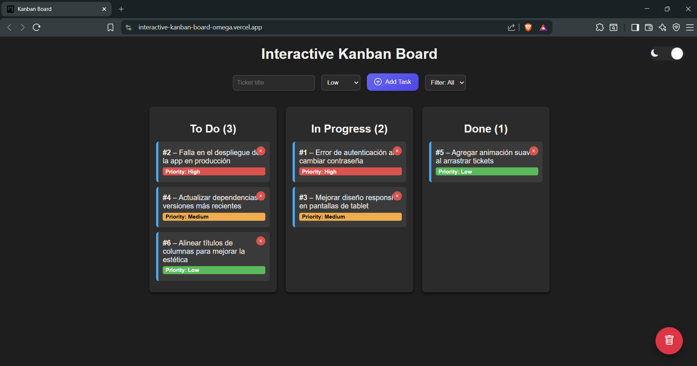

<h1 align="center">Tablero Kanban Interactivo</h1>


Un tablero basandose en la metodología agil *Kanban* totalmente interactivo desarrollado con **HTML, CSS y JavaScript puro**, que permite gestionar tareas de forma visual dinámica, asi como tambien enfocado en demostrar el manejo del DOM, eventos, lógica de negocio y persistencia con **LocalStorage**..
Este proyecto está diseñado para mostrar habilidades de desarrollo frontend sin depender de frameworks o librerias.

---

## Descripción General

El Tablero Kanban permite gestionar tareas (tickets) a través de tres estados:

- **To Do** – tareas pendientes
- **In Progress** – tareas en proceso
- **Done** – tareas completadas

Cada ticket cuenta con:
- Título
- Prioridad (Alta, Media, Baja)
- Identificador único

El tablero incluye restricciones y validaciones para simular un flujo de trabajo real.

---

## Funcionalidades Principales

### Creación de tickets
- El usuario puede crear tickets desde el formulario superior.
- Es obligatorio ingresar un título.
- Los tickets siempre se crean en la columna **To Do**.

### Prioridades
- Cada ticket tiene una prioridad visual:
  - 🔴 Alta
  - 🟡 Media
  - 🟢 Baja

### Drag & Drop
- Los tickets se pueden arrastrar entre columnas.
- Restricciones implementadas:
  - No se puede mover directamente de **To Do → Done**.
  - No se puede regresar de **Done → To Do**.
  - La columna **In Progress** tiene un límite de **5 tickets**, para no acumular pendientes y terminar los que ya estaban.

### Filtro por prioridad
- Permite mostrar solo tickets según su prioridad.
- No elimina información, solo cambia la visibilidad.

### Contadores automáticos
- Cada columna muestra dinámicamente el número de tickets que contiene.

### Persistencia con LocalStorage
- Uso de **LocalStorage** para:
  - Guardar todos los tickets.
  - Mantener su estado y columna.
  - Conservar el contador de tickets.
- Los datos se restauran automáticamente al recargar la página.

### Borrado del tablero
- Botón **“Borrar Todo”** con validaciones:
- Validaciones:
  - Si el tablero está vacío, se muestra advertencia.
  - Si hay tickets, se solicita confirmación personalizada.
- Limpia el tablero y el LocalStorage de forma segura.

### Modo Oscuro (Dark Mode)
- Activación/desactivación mediante botón tipo switch.
- Preferencia guardada en **LocalStorage**.
- El modo seleccionado se mantiene al recargar la página.
- Implementado sin duplicar estilos ni romper el diseño original.

### Mensajes personalizados
- Advertencias visuales con animación *fade in / fade out*.
- Confirmaciones personalizadas en lugar de `confirm()` del navegador.
- Mejor experiencia de usuario (UX).

---

## Flujo de Trabajo Kanban

1. El usuario crea un ticket en **To Do**.
2. El ticket pasa a **In Progress** cuando se comienza a trabajar.
3. Solo después puede moverse a **Done**.
4. El sistema impide saltos de estado incorrectos.

Este flujo simula buenas prácticas reales de metodologías ágiles.

---

## Tecnologías Utilizadas

- **HTML5**
  - Estructura semántica del tablero.
- **CSS3** 
 - Diseño visual, estados, mensajes, animaciones y Dark Mode.
- **JavaScript (Vanilla)**
  - Manipulación del DOM.
  - Drag & Drop.
  - Validaciones de negocio.
- **LocalStorage** 
  – Persistencia de datos

---

## Estructura del Proyecto

```
/interactive-kanban-board
│
├── index.html     # Estructura principal
├── styles.css     # Estilos del tablero
├── main.js        # Lógica del Kanban
├── assets/        # Iconos o recursos
└── README.md      # Documentación del proyecto
└── LICENCE        # Defince las reglas legales del uso
```

---

## Ejemplos de Tickets

- "Implementar login con JWT"
- "Corregir bug en formulario de registro"
- "Diseñar vista de perfil de usuario"
- "Optimizar consultas a la base de datos"
- "Agregar validaciones al formulario"

---

## Objetivo del Proyecto

Este proyecto fue creado con fines de:
- Práctica de JavaScript puro
- Demostración de lógica de negocio
- Portafolio profesional
- Simulación de un entorno real de trabajo

---

## Vista previa
<div align="center">
  
</div>

---

## Autor

*Desarrollado por Byron Jorge Ortega Cuenca*
*Si te gusto este proyecto, !no olvides en dejar una ⭐ en el repositorio¡.*